# Equipment Program

C# WPF로 제작한 장비 배치 및 관리 프로그램입니다.
연구실 또는 작업 공간의 기구를 지도 형태로 배치하고, 각 기구에 포함된 장비 정보를 등록, 검색, 관리할 수 있습니다.

## 메인 화면

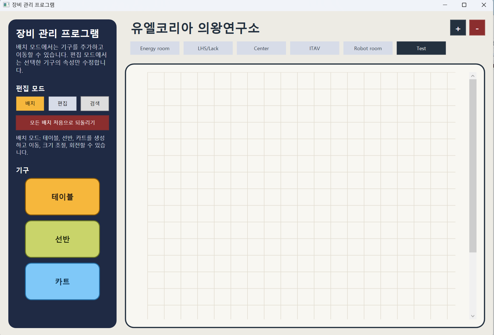

## 주요 기능

- 테이블, 선반, 카트 배치
- 드래그 앤 드롭 기반 위치 지정
- 기구 이동, 크기 조절, 회전, 삭제
- 장비 이름, 장비 구분, UL 번호, Global 번호, 비고 관리
- 장비 사진 등록 및 미리보기
- 여러 지도 생성, 이름 변경, 삭제
- 장비 이름, UL 번호, Global 번호 기준 검색
- 배치 정보와 장비 정보를 JSON 파일로 저장

## 배치 기능

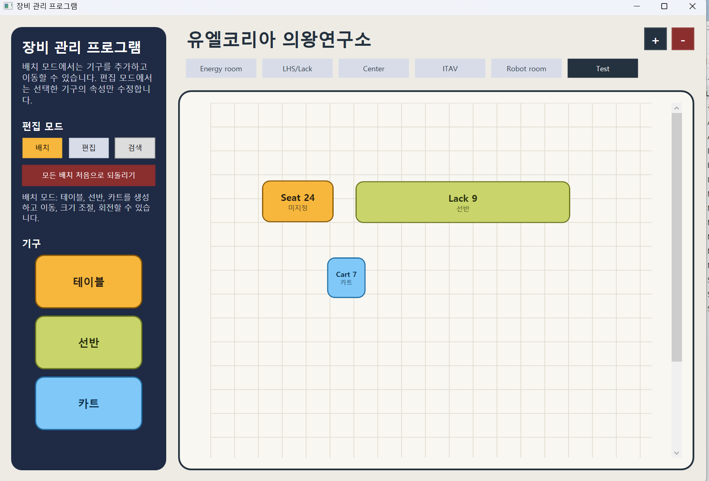

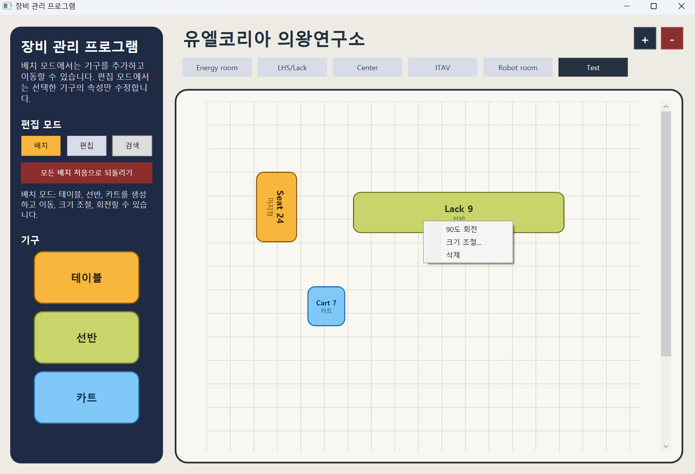

## 편집 기능

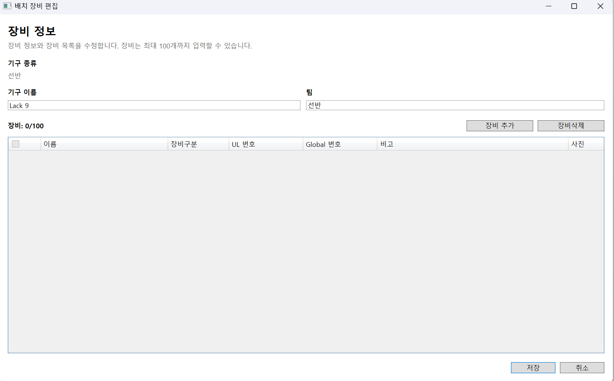

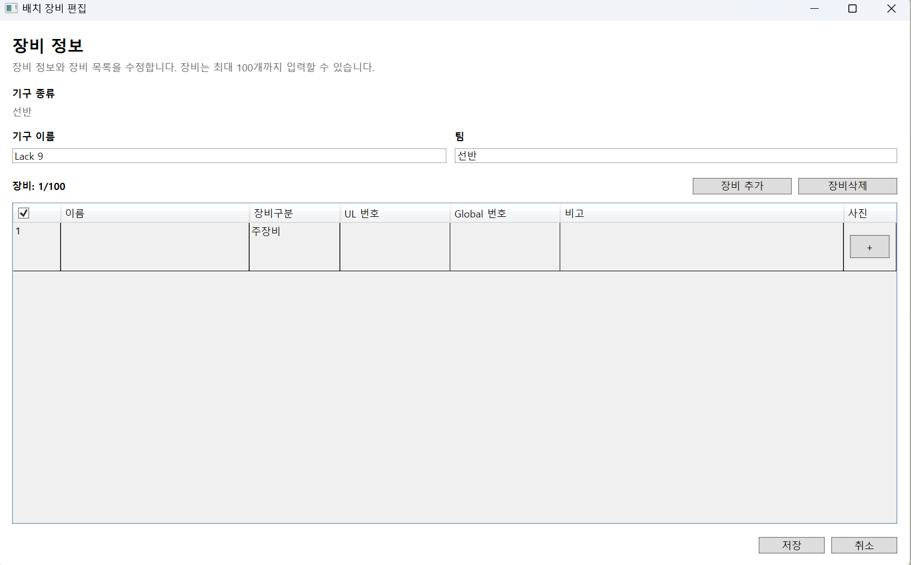


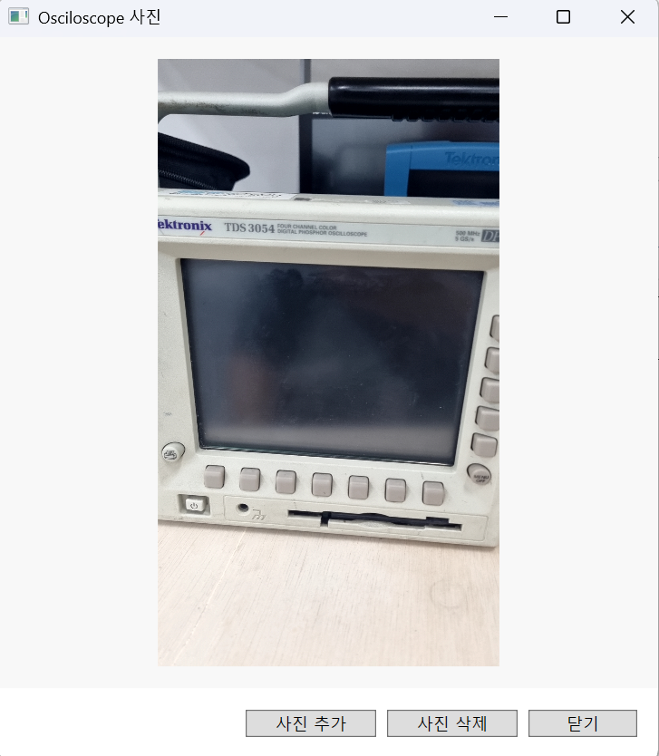

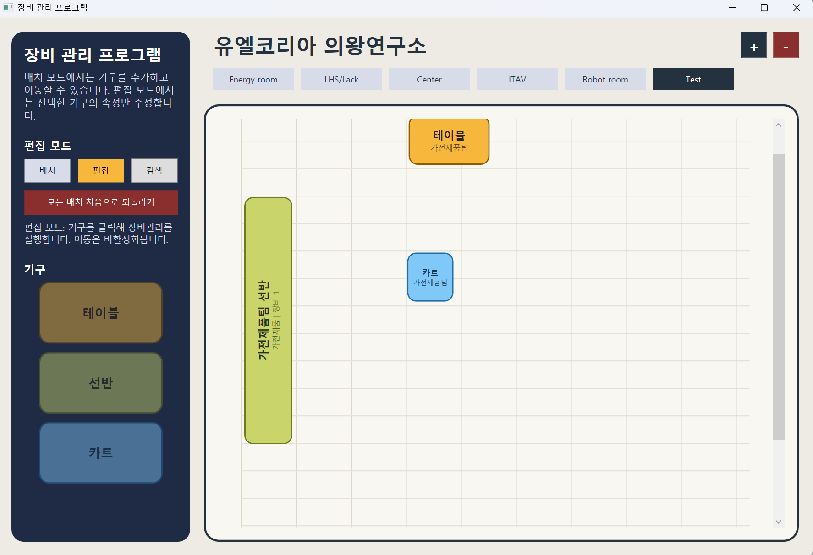

## 검색 기능

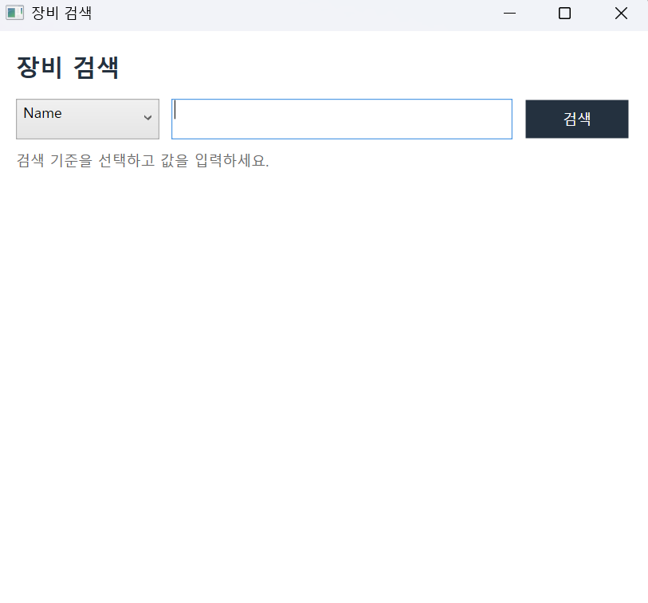

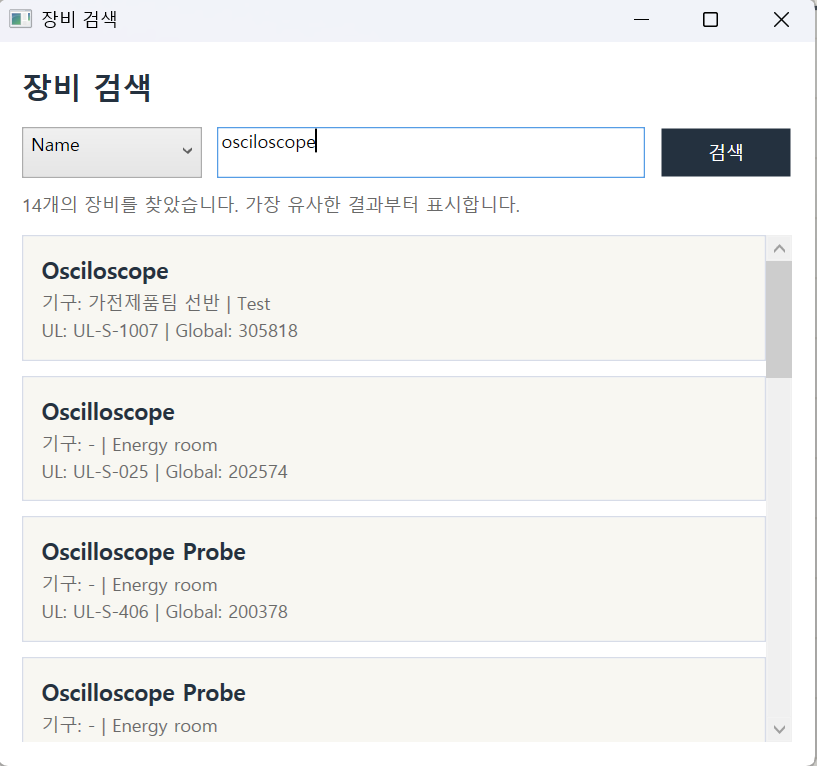

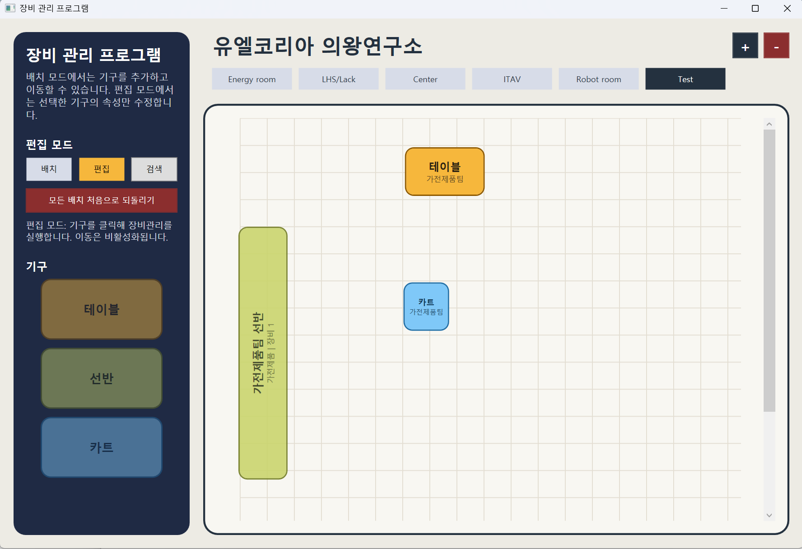

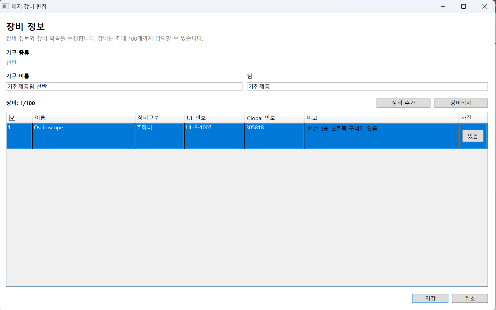

## 개발 환경

- Windows
- .NET 10
- C#
- WPF
- Visual Studio

## 실행 방법

저장소를 클론합니다.

```bash
git clone https://github.com/jungwooyoung1234567/Equipment-program.git
```

프로젝트 폴더로 이동합니다.

```bash
cd Equipment-program
```

Visual Studio에서 `UL_project.csproj` 파일을 열고 실행합니다.

.NET CLI를 사용할 경우 다음 명령어로 실행할 수 있습니다.

```bash
dotnet run --project UL_project/UL_project.csproj
```

## 프로젝트 구조

```text
UL_project/
├── App.xaml
├── MainWindow.xaml
├── MainWindow.xaml.cs
├── MainWindow.MapManagement.cs
├── MainWindow.SeatPlacement.cs
├── MainWindow.SeatEditing.cs
├── MainWindow.Persistence.cs
├── SeatEditorWindow.cs
├── EquipmentFindWindow.cs
├── EquipmentInfo.cs
├── SeatInfo.cs
├── LayoutState.cs
└── UL_project.csproj
```

## 저장 데이터

프로그램 실행 폴더에 다음 파일이 생성됩니다.

```text
layout.json
layout.json.bak
```

- `layout.json`: 현재 지도, 기구 위치, 장비 정보 저장
- `layout.json.bak`: 기존 저장 파일 백업
